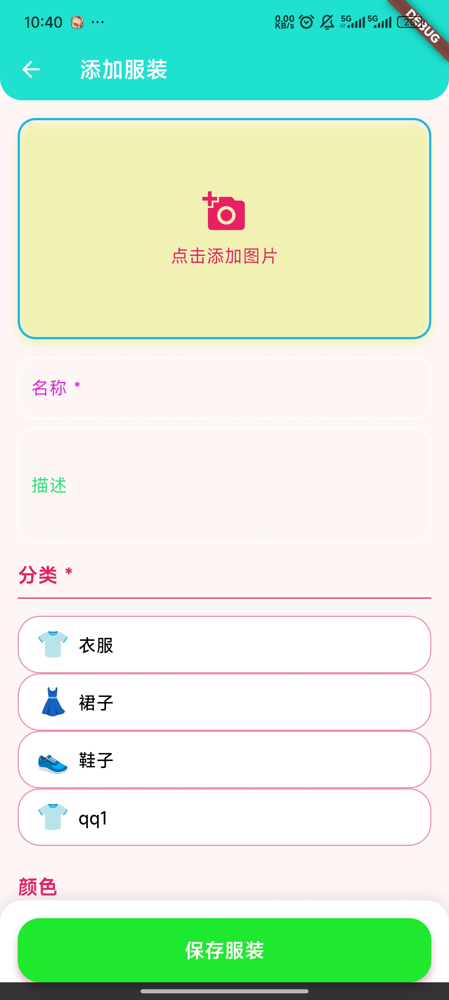
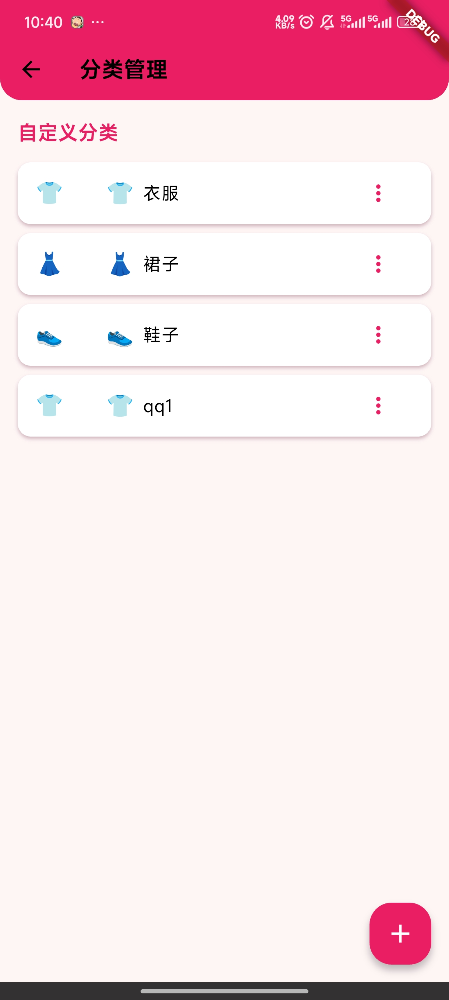
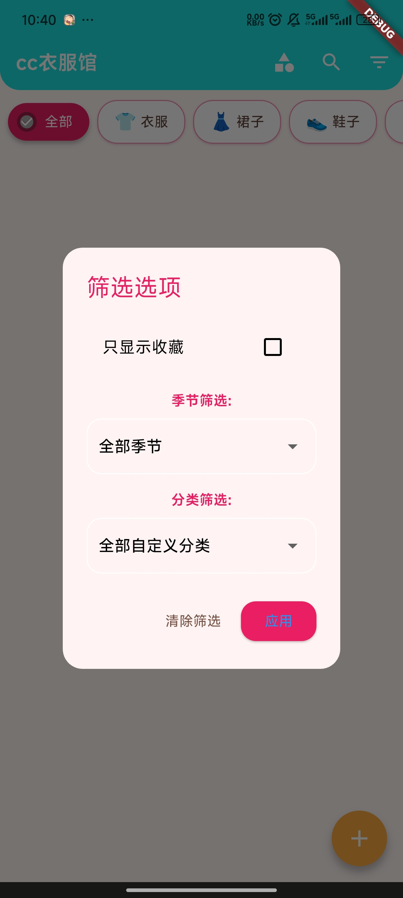
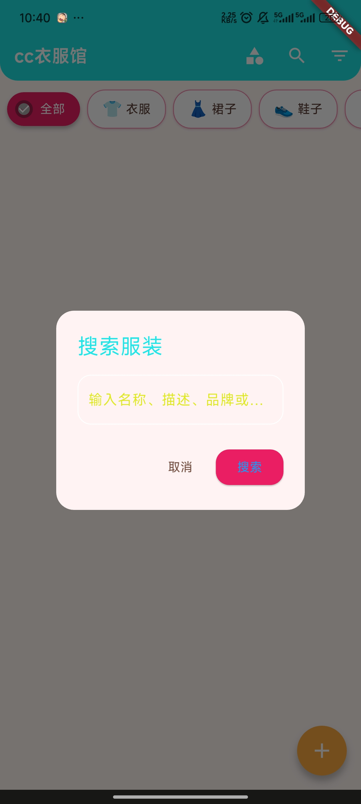

# andiron
一个轻量、易用的 Flutter 衣服管理 App，支持衣服分类管理、图片上传、筛选/搜索等核心功能，帮你高效管理个人衣柜。

## 📱 应用预览
<!-- 响应式多图并排，桌面端横向展示，移动端纵向展示 -->
<p align="center">
  
  
  
  
  
</p>

## ✨ 核心功能
- 🔍 衣服快速搜索/筛选（按类型、季节、颜色等）
- 📸 衣服图片上传与预览
- 🗂️ 自定义衣服分类管理
- 📱 适配安卓/iOS 双端

## 🚀 Getting Started

### 环境准备
- Flutter 3.16+
- Android SDK 21+ / iOS 12+
- Git

### 运行步骤
1. 克隆仓库
   ```bash
   git clone https://github.com/knight12366/my-wardrobe-app.git
   cd my-wardrobe-app